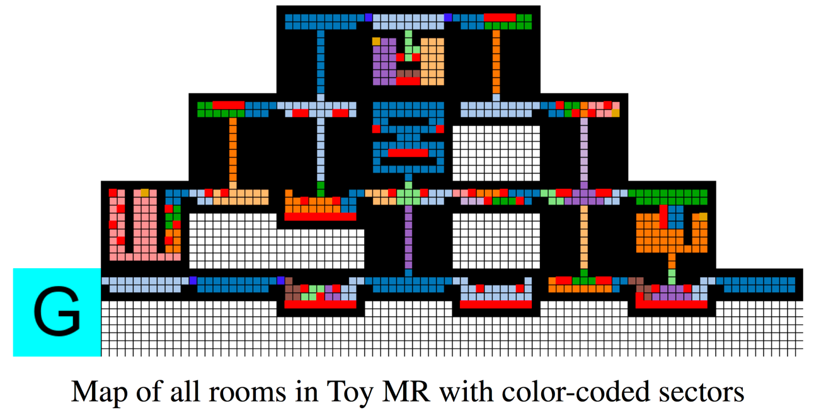

Toy Montezuma's Revenge
=======================




This is a reproduction of the Toy Montezuma's Revenge environment described in
[Deep Abstract Q-Networks (Roderick et al., 2017)](https://arxiv.org/abs/1710.00459).

Rewards:

* +100 for picking up a key
* +300 for opening a door
* +10000 for reaching at the goal location


## Usage

Demo (play by hand):

```bash
python -m mr_pycolab.toy_montezuma

# All rooms are fully observable rather than partially:
python -m mr_pycolab.toy_montezuma --full-observation
```

## OpenAI gym

```python
import mr_pycolab, gym
env = gym.make("ToyMontezumaRevenge-v0")

s = env.reset()   # [11, 11, 5]

actions = ('D', 'U', 'L', 'R', '?')
s, r, done, info = env.step(env.action_space.sample())
```
